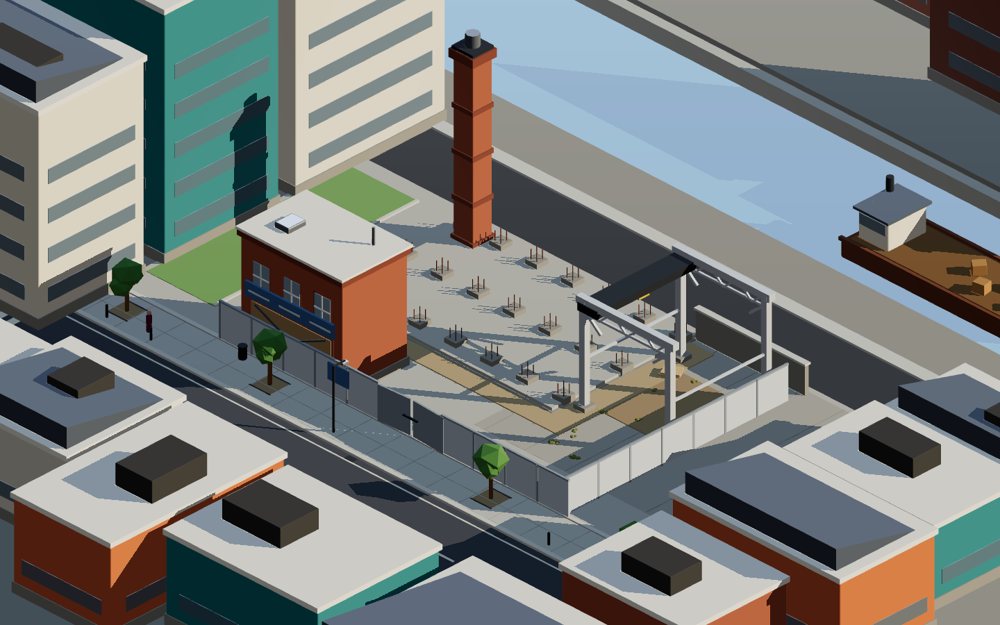
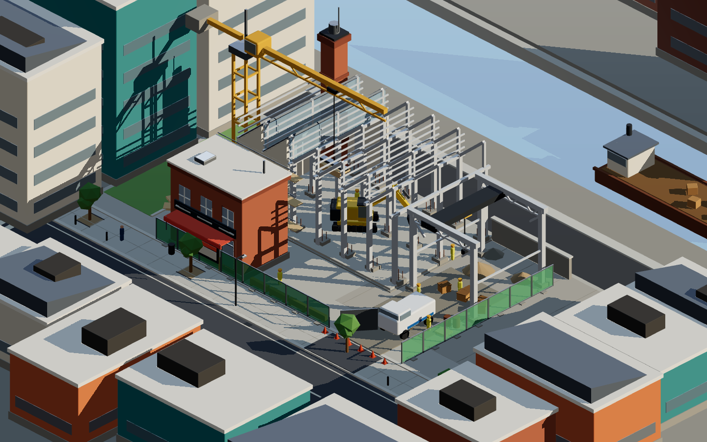
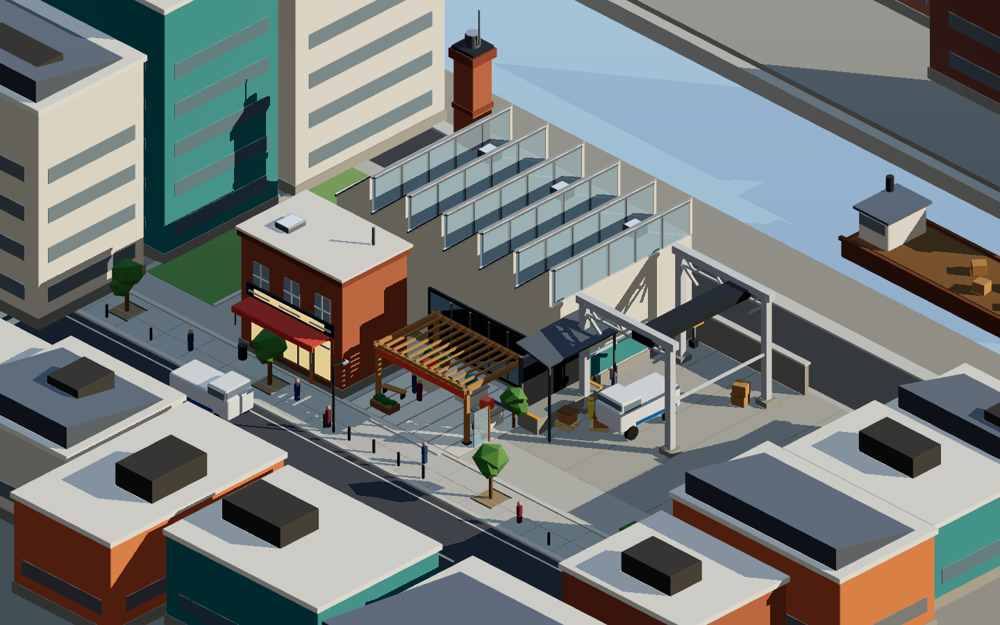
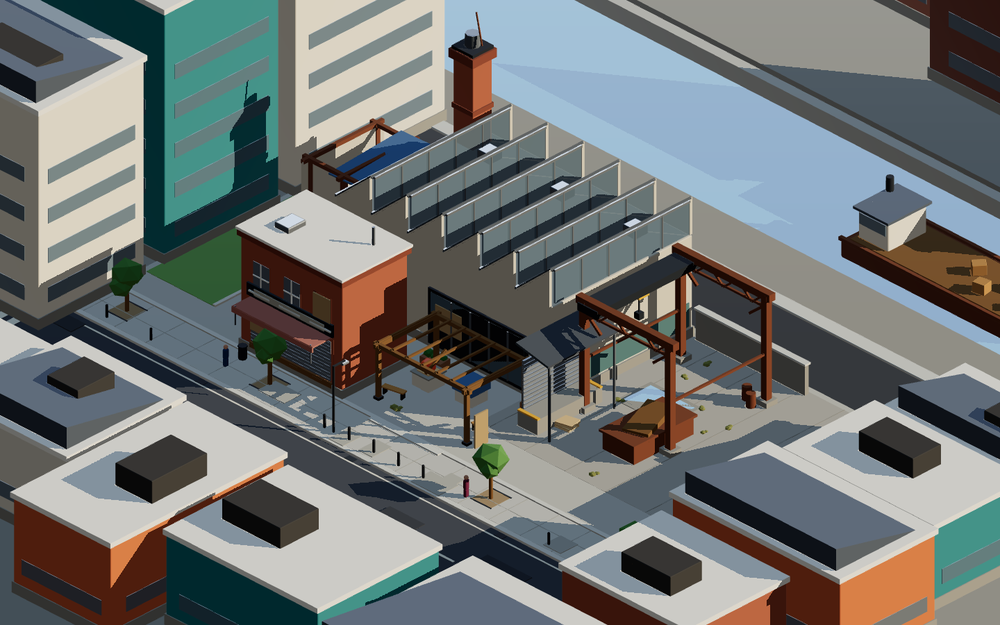
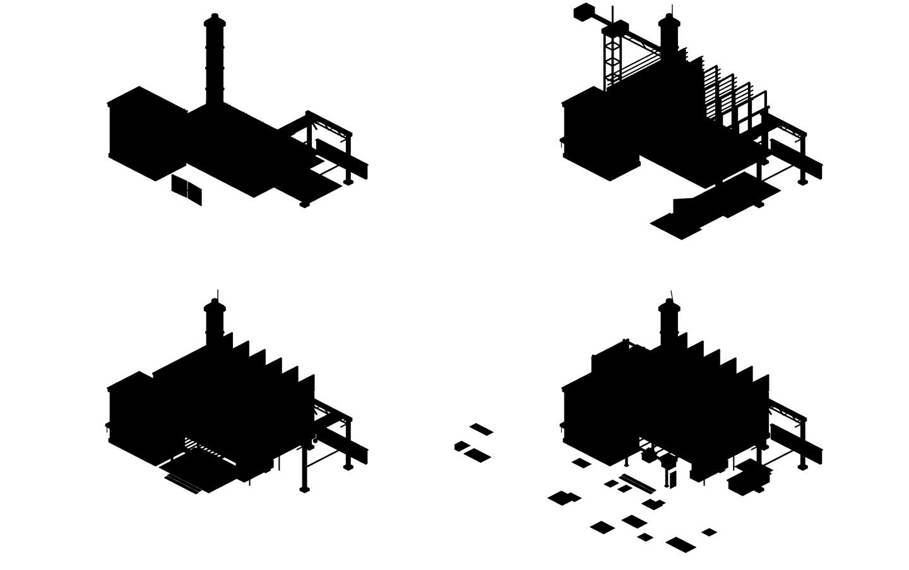

# Offer Forge — progression block

A throwaway visual-production spike. One maker-district city block in Three.js,
authored to evolve physically through four states on the same lot, at a fixed
isometric strategy camera.

This is **not** product code. It touches no Whop data, no adapters, no auth, no
network. It exists to answer one question: can a browser-native low-poly block
carry the tactile, authored, inhabited quality of a premium city-builder?

## The four states

The same lot, the same camera, the same seed.

| | |
| --- | --- |
|  **Dormant** — hoarded frontage, bare slab with pad footings and starter bars, boarded shopfront, sign wrapped in a tarp, dust over the old apron |  **Rising** — tower crane, steel frame with two of six bays clad, scaffold and debris netting, excavator, haul route, mesh fencing, crew |
|  **Healthy** — glazed sawtooth shed, open roller door and loading dock, pergola plaza with display plinths, trees and benches, delivery under way |  **Struggling** — same shed, shutters down and a bay boarded, stalled extension rusting under a tarp, skip, patched road, weeds, thin footfall |

Silhouette check — architecture only, flat black on white:



The street unit, the vent stack and the yard gantry are the persistent spine and
are recognisable in all four. Healthy and struggling share an identical roof
profile, which is the requirement that the lot stays the same place when it
declines.

## Running it

```
cd art-spikes/progression-block
pnpm install
pnpm dev            # http://127.0.0.1:5180
```

The four states are switchable from the bar at the bottom. Useful URL params:

| Param | Effect |
| --- | --- |
| `?state=rising` | Open directly in a state |
| `?bare=1` | Hide the switcher — what the capture harness uses |
| `?fh=90` | Override the camera frustum height, for looking at the whole world |

Capture, with the dev server already running:

```
pnpm capture       # four stills + silhouette sheet + 12s MP4 -> /opt/cursor/artifacts
node capture/silhouette.mjs   # just the silhouette contact sheet
node capture/preview.mjs healthy /tmp/out.png
```

Capture runs headless Chrome on SwiftShader, so it needs no GPU. It renders
about 2 frames per second, and the 360-frame video takes roughly three minutes.

## Scene graph and asset architecture

```
createLot({ seed, district, archetype, state })
└── THREE.Group  "lot:offer-forge:maker-block:<state>"
    ├── "ground"            merged, per material     road, kerb, footway, lot,
    │                                                service lane, quay, creek
    │                                                bed, land, tree pits
    ├── "creek"             merged, per material     pier, piles, moored barge
    ├── "neighbours"        merged, per material     surrounding massing, cut by
    │                                                the frame on three sides
    ├── "offer-forge:<state>"  merged, per material  everything on the lot
    │     ├─ persistent  street unit · vent stack · yard gantry
    │     ├─ dormant     slab, pad footings, starter bars, hoarding, wrapped sign
    │     ├─ rising      steel frame (2 of 6 bays clad), tower crane, scaffold,
    │     │              debris netting, excavator, haul route
    │     ├─ healthy     clad shed, glazed sawtooth north lights, roller door,
    │     │              loading dock + canopy, pergola plaza, display plinths
    │     └─ struggling  same shed shuttered + boarded, stalled rusting
    │                    extension under a tarp, skip, patched road, weeds
    └── "props:<state>"     one InstancedMesh per prototype
```

Two structural ideas do most of the work.

**Parts are authored small and merged per material.** `PartsBuilder` collects
every piece — a cill, a mullion, a gutter, a knee brace — into a bucket keyed by
material, then emits one merged mesh per bucket. The workshop is about forty
authored parts and lands as a handful of draw calls. All geometry is normalised
to non-indexed with matching attributes first, because mixing indexed primitives
with non-indexed `ExtrudeGeometry` makes `mergeGeometries` fail and silently
drop parts.

**Nothing is a raw box.** Every mass is a `RoundedBoxGeometry`, so edges catch
a highlight. That single substitution is most of the distance between "cubes"
and "moulded toy model".

**State is a rebuild, not a toggle.** Switching state disposes the lot and
builds a new one. A state is a different set of structures standing on identical
ground — not the same structures tinted, scaled or hidden.

## Renderer stats

Measured from `renderer.info` at 1440×900, reported by `pnpm capture`:

| State | Triangles | Draw calls | Instances | Prototypes | Geometries |
| --- | --- | --- | --- | --- | --- |
| dormant | 40,140 | 66 | 88 | 14 | 67 |
| rising | 62,806 | 92 | 180 | 29 | 91 |
| healthy | 55,776 | 79 | 101 | 23 | 80 |
| struggling | 46,820 | 79 | 96 | 18 | 80 |

Six textures total: one sky gradient, its PMREM chain, and the shadow map. No
image files are loaded — the sky is drawn into a canvas at boot.

The draw-call count is dominated by material variety, not object count. There
are 60-odd materials in the palette and roughly one call per material actually
used per merged group, plus one per instanced prototype. Halving it is mostly a
matter of merging the palette with a vertex-colour atlas, which is the obvious
next optimisation and was not worth it at this scale.

## What is instanced

`InstanceKit` registers prototypes and places them by matrix; each prototype
becomes one `InstancedMesh`. Multi-material props register one prototype per
material and are placed with a shared matrix, so `Prop.tree(...)` is one call at
the authoring layer and two batches on the GPU.

Instanced: trees (trunk, canopy, dry canopy), planters, weeds, bollards,
benches, bins, lamp posts and heads, cones, barriers, pallets, crates, drums,
sacks, dirt and gravel piles, mesh fence panels with frames and ballast feet,
hoarding panels and rails, scaffold posts, decks and rails, pedestrians,
hi-vis workers, delivery vans, and the vent-stack signage brackets.

Not instanced, because there is exactly one of each: the excavator, the tower
crane, the barge, and all architecture. The excavator is authored with the same
`PartsBuilder` and then folded into the parent's material buckets, so a posed
one-off still costs no extra draw call.

## How a second district reuses this

The district-specific surface is deliberately thin. `src/city/lot.ts` holds a
registry:

```ts
const BUILDERS = {
  "offer-forge": { "maker-block": buildOfferForge },
};
```

A second district is one new entry and one new builder module. Everything else
is shared unchanged: the ground system, the creek and neighbour massing, the
material palette, the whole prop kit, the camera and lighting, the seeded RNG,
the four-state vocabulary, and the capture harness.

A builder receives `(kit, state, seed)` and does two things — author structures
into a `PartsBuilder`, and scatter props through the `InstanceKit`. So
**Commerce Core** would author towers with setbacks, a transit canopy and
storefront bays instead of a sawtooth shed, and lean on the existing kit for
street trees, lamps, bollards, pedestrians and vehicles. **Creator Quarter**
would author live-work terraces, a small venue and rooftop rigging, and would
want perhaps four new prototypes — a satellite dish, a lighting truss, a market
umbrella, a roof planter.

The rough split observed here: about 700 lines of district-specific authoring
against about 750 lines of reusable system. A second district should cost the
first number, not both.

The ground currently hard-codes one street and one creek. Generalising it to a
parameterised parcel — frontage direction, depth, and which edges are street,
alley, water or neighbour — is the one piece of real work a second district
would force, and it is the right time to do it.

## Self-critique — the three largest gaps against a polished strategy game

**1. Every surface is a flat colour fill.** There is not one texture in the
scene. No albedo variation, no normal maps, no roughness breakup, no decals, no
grime in the corners, no edge wear on the kerbs, no lettering on the signs. A
shipped game gets most of its tactility from surface, and this gets none — which
is why it still reads closer to clean vector illustration than to a physical
model. The signage is the most visible symptom: the sign boards are coloured
rectangles because there is no text rendering, so the maker frontage has no
identity beyond its shape.

**2. There is no ambient occlusion, and the shading is thinner than it looks.**
Lighting is one directional sun with a soft shadow map, a hemisphere term, and an
image-based fill from a canvas sky gradient. What is missing is contact darkening
where surfaces meet — under awnings, inside window reveals, in the gutter valleys,
where a planter meets paving. Without it, forms sit *in front of* each other
rather than nestling into each other, and the whole image stays slightly flat.
An SSAO pass, or baked vertex AO at build time, is the single highest-value
addition and I did not get to it. The contact-shadow texture helper exists in
`geom.ts` and is currently unused.

**3. Nothing moves, and the people are unposed blocks.** The brief asked for
walkers, vehicles, smoke, flags and fountains, and the spike delivers a static
frame — the video's only motion is a camera sway. Worse, the pedestrians are two
stacked rounded boxes with a sphere on top, identical, facing fixed directions,
with no gait, no arms, no variation in height or colour beyond two body
materials. In Clash or Townscaper the ambient life is most of what sells the
place as inhabited; here a still frame and a moving frame are nearly the same
image. Animation was scoped out to get the four states standing up, and it is
the most obvious thing missing when you watch the video rather than look at the
stills.

Two smaller ones worth recording: the building vocabulary is still fundamentally
prismatic — no curves, no chamfered corners at the urban scale, no material
changes partway up a facade — and there is no post-processing at all, so no
bloom on the lit signage, no subtle vignette, and no colour grading to pull the
whole frame toward a coherent warm key.
