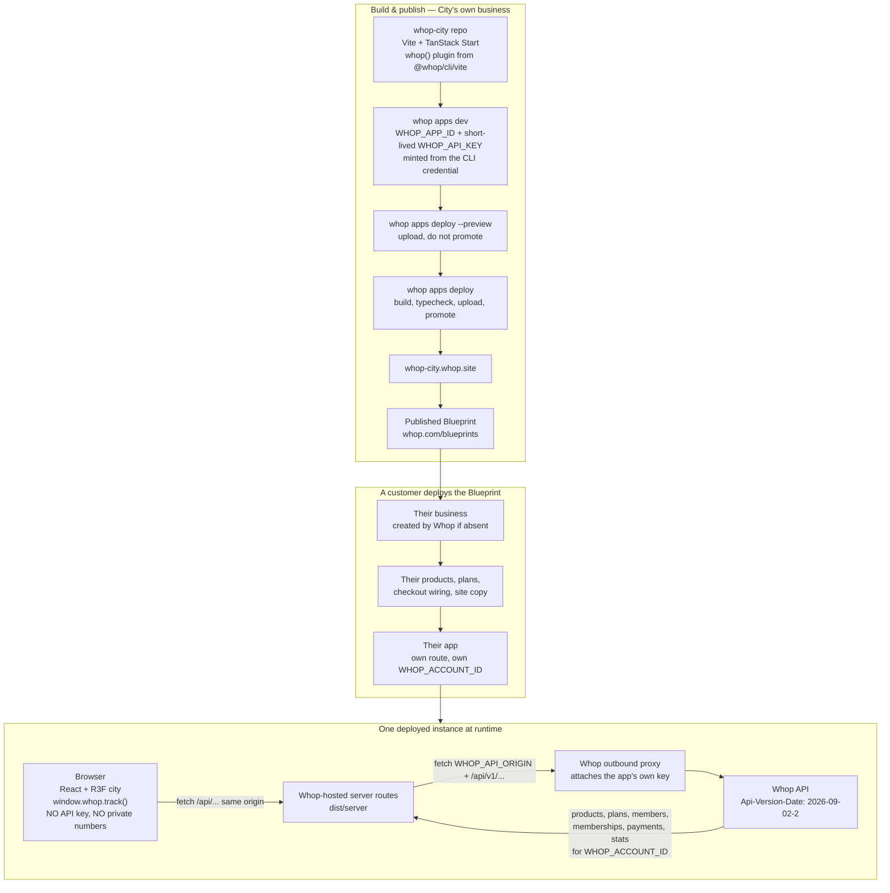

# Whop City architecture: Whop Website + Blueprint

Supersedes the OAuth / third-party-app architecture in
[PR #2](https://github.com/siyabendoezdemir/whop-city/pull/2). Nothing in this
document has been built yet, and no `whop apps init`, deploy, Blueprint
publication, or Whop write has been performed.

Every claim below is labelled `verified` (read out of Whop's own docs, CLI, or
API today) or `unverified` (needs the Task 1 spike to settle).

## What this is

City is an app of type `website`. Whop hosts it, serves it at
`<route>.whop.site`, and it is publishable as a Blueprint. Deploying the
Blueprint gives a customer their own business, their own copy of the products
and the site, and their own app — and City then renders **that** business.

There is no seller OAuth, no PKCE, no refresh-token vault, no app-install
permission grant, no business picker, and no external API service.

`verified` — "A Whop website is an app of type `website`: a site visitors
browse at `<route>.whop.site`, hosted by Whop." Deploying a blueprint means
"Whop creates your business if you don't have one, copies the products and the
site over, and serves it at your route", and cloning "registers a new app …
The directory links to *your* app".

`verified` — the app type is permanent: "A `website` can't be converted into a
Whop app (`b2c_app`) later."

## Diagram



### Runtime bindings

`verified` — the hosted runtime sets `APP_ID`, `BUILD_ID`, `WHOP_API_ORIGIN`,
`WHOP_ACCOUNT_ID` ("the `biz_` id of the account that owns the app"), `ASSETS`,
and `REALTIME`. These names are reserved and a same-named secret is ignored.

`verified` — server-side `fetch` to the Whop API passes through an outbound
proxy that attaches the app's key: "The key never reaches your code, so it
can't be read, logged, or bundled." Send `x-whop-inject-key: none` to leave a
server-side request unauthenticated.

`verified` — the injected key "belongs to the app's own business and can't move
money… It also authenticates as your business, never as the visitor."

`verified` — `whop apps dev` sets `WHOP_APP_ID` and a short-lived token as
`WHOP_API_KEY`, minted from the CLI credential, plus every stored app secret.

**`unverified`, and the first thing the spike must settle:** local dev and the
hosted runtime are not the same environment. Production injects the key via a
proxy and sets `WHOP_API_ORIGIN` / `WHOP_ACCOUNT_ID`; local dev hands you a
`WHOP_API_KEY` and documents neither of those two bindings. City needs one
server code path that works in both, so the spike must print the actual
environment under `whop apps dev` and confirm which bindings exist.

## Whop hosting versus external persistence

### Provided by Whop hosting

| Need | Provided by | Verified |
| --- | --- | --- |
| Static assets and SSR | `dist/client` served directly, `dist/server` runs | yes |
| Server-side Whop API auth | Outbound proxy, app's own key | yes |
| Business identity | `WHOP_ACCOUNT_ID` | yes |
| Config and secrets | `whop apps secrets set/list/unset`, encrypted at rest | yes |
| Versioning and rollback | `whop apps builds promote <build_id>`, Versions tab | yes |
| Server logs | `whop apps logs`, retained 7 days | yes |
| Analytics | Pixel pre-installed, plus `whop.track()` | yes |
| Business data | The Whop API itself, scoped to `WHOP_ACCOUNT_ID` | yes |

### Not provided — the honest gap

**Whop hosting exposes no general-purpose datastore.** There is no KV, SQL, or
object-storage binding in the Websites documentation. `whop apps secrets` is
configuration, not runtime-writable application state.

So the only durable places City can write are Whop's own objects:

| Store | Reality | Verified |
| --- | --- | --- |
| Product `metadata` | Arbitrary key/value, writable on create and update, readable on both retrieve and list rows | yes |
| Plan / membership `metadata` | Same, on those resources | yes |
| Account `metadata` | `PATCH /accounts/{id}` accepts it, but needs `company:update`, and the docs state an Account API key **cannot edit its own account** — so the injected key probably cannot use this | partly; the block is `unverified` |

**Design consequence.** v1 keeps zero external persistence by making all city
state *derived*:

- District health and mission availability are pure functions of the current
  business snapshot. Nothing to store.
- The receipt for the one write is carried by the created product itself:
  City stamps the intent hash and confirmation time into the product's
  `metadata`, so the receipt is recoverable by reading the product back.

Two things genuinely need durable state and are therefore **deferred out of
v1**, consciously rather than quietly:

1. **Manual mission claims.** A `claimed` state that is not derivable from
   Whop data has nowhere to live. Either v1 ships only `available` /
   `verified` missions, or we add a store on purpose.
2. **The cross-business leaderboard.** It needs a service that sees every
   deployed instance, which is by definition not a per-business website. Out
   of v1.

Also unrecoverable without a store: a **failure** receipt. A write that fails
creates no product to stamp. v1 surfaces failures in the session and in
`whop apps logs` (7 days), and does not promise a durable failure ledger.

## The exact init command and route

```bash
whop apps init --app_type website --name "Whop City" --route whop-city
```

`--company_id biz_xxxxxxxx` pins it to City's own test business rather than
whatever account the CLI has selected; the CLI defaults to the active account
and requires the flag when the credential has none.

- Route slug: `whop-city`
- App type: `website`, **permanent and unchangeable**
- Scaffold target: `./whop-city` by default; `--dir` overrides

**Address discrepancy, `unverified`.** The Websites docs say the address is
`<route>.whop.site`, and `whop.site` resolves and serves per-subdomain today
(`shine-time.whop.site` returns 404 for an unclaimed route). The CLI's own help
in `whop@0.16.3` says `<route>.whop.app` and describes apps as
"*.whop.app". The route slug is the same either way; confirm which domain the
live address uses at init and record it.

**Repo shape.** `whop apps init` scaffolds a TanStack Start project, installs
dependencies, and runs `git init`. Running it inside this repository would
nest a git repo. Recommended: scaffold to a scratch directory, move the result
to the repository root, and drop the nested `.git`. Root — rather than
`apps/web` — because `whop apps deploy` uploads a source archive of the project
directory and `whop apps pull` three-way merges it back, and a Blueprint cloner
should receive exactly the site. That also means the pnpm workspace from PR #2
goes away in favour of a single package.

## PR #2 file disposition

PR #2 stays unmerged. Roughly two thirds of its code is architecture-neutral
API safety work that would be wasteful to rewrite.

### Retain as reusable API safety utilities

| File | Why it survives |
| --- | --- |
| `packages/whop-client/src/redaction.ts` | Secret stripping, identifying-field scrubbing, deterministic ID pseudonymization, and the `assertNoCredentialLeak` guard. Nothing in it referenced OAuth. |
| Idempotency logic in `capability-probe.ts` | `buildIdempotencyKey`, the two-layer dedupe, and `Idempotent-Replayed` handling directly implement the review → confirm → execute → receipt rule. |
| `classifyStatus` / `extractErrorMessage` | Whop's error envelope and status semantics are the same whatever credential is used. |
| `normalizeBusinessSnapshot` | The city engine's input contract, including the null-not-zero rule. |
| The write gate | "Refuse writes unless explicitly enabled" matters more now, not less. |
| `scripts/extract-openapi-scopes.ts` + `tests/fixtures/whop-openapi-scopes.json` | Drift detection against Whop's published spec. Reframe from "scopes" to "operations". |
| `WHOP_API_VERSION_PIN` + its contract test | The pin is architecture-independent and still mandatory. |
| Redaction and secret-scan tests | Keep as-is. |

### Remove

| File / section | Why it goes |
| --- | --- |
| `docs/whop-permission-matrix.md` | Framed entirely around OAuth scopes and app-install permission grants. Its architecture-independent findings — version pin, idempotency semantics, webhook mechanics, the affiliate gap, sandbox and CLI limits — get folded into a new `docs/whop-website-capability-matrix.md`. |
| OAuth scope tables in `capability-manifest.ts` | `requiredScopes` becomes "what the injected key must already be able to do", answered by `GET /permissions` rather than declared by City. |
| Tests asserting OIDC scopes, PKCE, and the email-scope exclusion | No OAuth flow to assert against. |
| `.env.example` OAuth block | `WHOP_APP_ID`, `WHOP_CLIENT_SECRET`, redirect URI, `WHOP_TEST_ACCESS_TOKEN` all go. The version pin and probe gates stay. |
| `pnpm-workspace.yaml` and the `packages/*` layout | Single package at the repo root. |
| `developer:manage_webhook` capability entries | Not a dependency any more; see below. |

### Webhooks

Dropped as a v1 dependency. The permission question that blocked PR #2 is moot
because City no longer asks a seller for anything — but a website has no
documented way to register its own webhook receiver as part of the hosted
runtime, and the `REALTIME` binding is one undocumented line ("Backs realtime
connections") with no page behind it. v1 therefore refreshes on explicit user
action and on navigation, and labels data `live` / `refreshing` / `delayed`.
No near-real-time claim until a website-native mechanism is proven.

## Open risks that need your decision

### 1. A `*.whop.site` site is public. This is the big one.

`verified` — `x-whop-user-token` exists only for apps rendering inside the
whop.com iframe, which is the `b2c_app` model. A `website` is browsed directly
at its route, so **there is no automatic visitor identity**. The Websites docs
document no visitor auth and no private-site setting.

Two consequences, both severe if unaddressed:

- Anything City renders is world-readable. Revenue, customer counts, and the
  product roster of the deployed business would be visible to anyone with the
  URL.
- Any visitor could POST to City's own server route and trigger the real
  write, because the injected key authenticates as the business regardless of
  who asked.

The write gate is non-negotiable either way. The options for the operator
surface, none of which I have adopted:

- **A. Split the surface.** Public route shows a non-sensitive city — shapes,
  tiers, and progress, no absolute numbers — and no operations at all. The
  operator surface is separate and gated. Keeps the Blueprint attractive as a
  public artifact.
- **B. Shared-secret operator session.** The deployer sets an app secret; the
  operator enters it once and gets a signed, expiring cookie. No OAuth, no
  consent screen, works entirely inside Whop hosting. Weaker than real auth and
  needs care against brute force.
- **C. Identity-only Whop OAuth.** `openid` alone, then check the signed-in
  user is a team member of `WHOP_ACCOUNT_ID` via `GET /team_members`. No
  permission grants, no refresh-token vault, no business picker — but it is
  still an OAuth consent screen, which you ruled out. Flagging it only because
  it is the sole option that gives a real identity.

My recommendation is **A plus B**: it satisfies "no seller OAuth consent flow"
literally, and A alone is not enough because the write still needs a gate.
This needs your call before any code.

### 2. Injected-key reach is unverified

The key "can't move money" and grants payout and transfer *reads*, but the docs
do not enumerate what else it can do. Whether it can read `stats`, read
`members`, and create a product is exactly what
`GET /permissions?resource_id=$WHOP_ACCOUNT_ID` will answer in one call. That
is the first thing the spike runs.

### 3. Whether affiliate reads work at all here

`/affiliates` is legacy-surface only, requires `account_id`, and has no
webhook. Under the injected key it is untested. Creator Quarter may have to be
narrowed to what `global_affiliate_status` on each product reveals.

### 4. The spike needs a Whop login

`whop apps dev` mints its token from the CLI credential, so the spike cannot
run in this environment: there is no Whop credential here and the Whop MCP
server reports `needsAuth`. Either add a Whop credential as a Cloud Agent
secret, or run the spike locally and paste the output.

## Sources

All fetched 2026-09-03, plus `whop@0.16.3` CLI help read directly.

- <https://docs.whop.com/developer/websites/overview.md>
- <https://docs.whop.com/developer/websites/blueprints.md>
- <https://docs.whop.com/developer/websites/hosting.md>
- <https://docs.whop.com/developer/websites/quickstart.md>
- <https://docs.whop.com/developer/websites/tracking.md>
- <https://docs.whop.com/developer/guides/authentication.md>
- <https://docs.whop.com/developer/api/idempotency.md>
- <https://docs.whop.com/openapi/api-v1-native.json>
