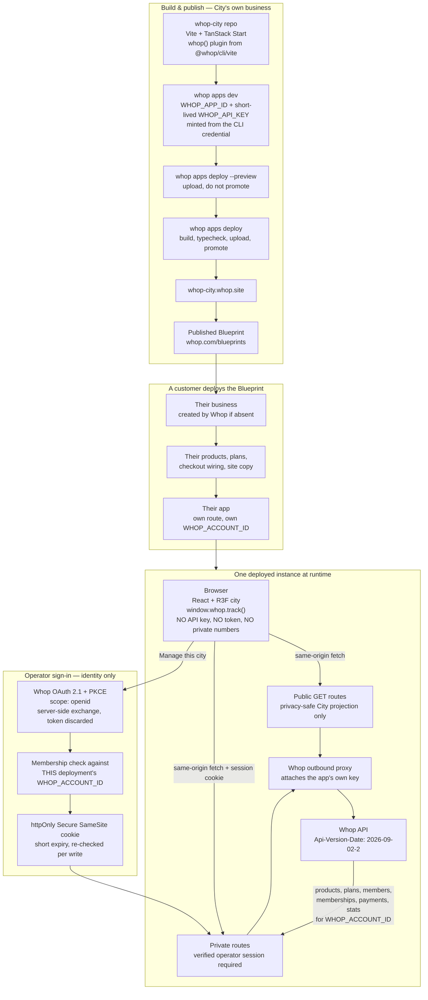

# Whop City architecture: Whop Website + Blueprint

Supersedes the OAuth / third-party-app architecture in
[PR #2](https://github.com/siyabendoezdemir/whop-city/pull/2). Nothing in this
document has been built yet, and no `whop apps init`, deploy, Blueprint
publication, or Whop write has been performed.

Every claim below is labelled `verified` (read out of Whop's own docs, CLI, or
API today) or `unverified` (needs the Task 1 spike to settle).

## What this is

City is an app of type `website`. Whop hosts it, serves it at
`<route>.whop.site`, and it is publishable as a Blueprint. Deploying the
Blueprint gives a customer their own business, their own copy of the products
and the site, and their own app — and City then renders **that** business.

There is no seller-install consent model, no cross-business OAuth integration,
no refresh-token vault, no app-install permission grant, no business picker, and
no external API service.

### What "no seller OAuth consent flow" means

It means City never asks a seller to grant it standing access to their business.
There is no install, no permission matrix, no stored refresh token, and no
credential that lets City act on a business it was not deployed into.

It does **not** mean the site is unauthenticated. A `whop.site` route is public
and has no built-in visitor identity, so the operator surface is gated by a
minimal identity-only "Sign in with Whop": OAuth 2.1 + PKCE requesting `openid`
alone, used once to learn who the visitor is, then discarded. The membership
check that follows is made against **this deployment's own** `WHOP_ACCOUNT_ID`
and nothing else. That is operator authentication, not a seller integration, and
it does not make City a `b2c_app`.

The full endpoint and permission model is in
[`docs/website-auth-spike.md`](website-auth-spike.md).

`verified` — "A Whop website is an app of type `website`: a site visitors
browse at `<route>.whop.site`, hosted by Whop." Deploying a blueprint means
"Whop creates your business if you don't have one, copies the products and the
site over, and serves it at your route", and cloning "registers a new app …
The directory links to *your* app".

`verified` — the app type is permanent: "A `website` can't be converted into a
Whop app (`b2c_app`) later."

## Diagram



### Runtime bindings

`verified` — the hosted runtime sets `APP_ID`, `BUILD_ID`, `WHOP_API_ORIGIN`,
`WHOP_ACCOUNT_ID` ("the `biz_` id of the account that owns the app"), `ASSETS`,
and `REALTIME`. These names are reserved and a same-named secret is ignored.

`verified` — server-side `fetch` to the Whop API passes through an outbound
proxy that attaches the app's key: "The key never reaches your code, so it
can't be read, logged, or bundled." Send `x-whop-inject-key: none` to leave a
server-side request unauthenticated.

`verified` — the injected key "belongs to the app's own business and can't move
money… It also authenticates as your business, never as the visitor."

`verified`, with an important qualifier — `whop apps dev` sets `WHOP_APP_ID` and
a short-lived token as `WHOP_API_KEY`, minted from the CLI credential, plus every
stored app secret. **The minting only happens when nothing is exported.** The
spike confirmed that an exported `WHOP_API_KEY` is forwarded to the dev runtime
verbatim, so a developer holding a dashboard API key silently gives the local app
their business's full authority instead of a scoped token.

**`measured` — the two environments differ, and dev is missing more than
expected.** Under `whop apps dev` the runtime receives `WHOP_APP_ID` and
`WHOP_API_KEY` and *neither* `WHOP_ACCOUNT_ID` nor `WHOP_API_ORIGIN`. Any code
that reads those two cannot run locally as written.

City should therefore not require either. Read `WHOP_APP_ID`, call the public
`GET /apps/{id}`, and take `account.id` as the business identity; default the API
origin to `https://api.whop.com` and let the binding override it. That gives one
server code path for dev and hosted, and it is what a Blueprint deployment needs
anyway, since each deployment gets a different business. Whether the hosted
runtime sets the two bindings is still unverified — settling it requires a deploy.

## Whop hosting versus external persistence

### Provided by Whop hosting

| Need | Provided by | Verified |
| --- | --- | --- |
| Static assets and SSR | `dist/client` served directly, `dist/server` runs | yes |
| Server-side Whop API auth | Outbound proxy, app's own key | docs only; in dev there is no proxy and the key is readable in `process.env` |
| Business identity | `WHOP_ACCOUNT_ID`, or `account.id` from the public `GET /apps/{WHOP_APP_ID}` | the binding is **absent in dev**; derive it from the app record instead |
| Config and secrets | `whop apps secrets set/list/unset`, encrypted at rest | yes |
| Versioning and rollback | `whop apps builds promote <build_id>`, Versions tab | yes |
| Server logs | `whop apps logs`, retained 7 days | yes |
| Analytics | Pixel pre-installed, plus `whop.track()` | yes |
| Business data | The Whop API itself, scoped to `WHOP_ACCOUNT_ID` | yes |

### Not provided — the honest gap

**Whop hosting exposes no general-purpose datastore.** There is no KV, SQL, or
object-storage binding in the Websites documentation. `whop apps secrets` is
configuration, not runtime-writable application state.

So the only durable places City can write are Whop's own objects:

| Store | Reality | Verified |
| --- | --- | --- |
| Product `metadata` | Arbitrary key/value, writable on create and update, readable on both retrieve and list rows | yes |
| Plan / membership `metadata` | Same, on those resources | yes |
| Account `metadata` | `PATCH /accounts/{id}` accepts it, but needs `company:update`, and the docs state an Account API key **cannot edit its own account** — so the injected key probably cannot use this | partly; the block is `unverified` |

**Design consequence.** v1 keeps zero external persistence by making all city
state *derived*:

- District health and mission availability are pure functions of the current
  business snapshot. Nothing to store.
- The receipt for the one write is carried by the created product itself:
  City stamps the intent hash and confirmation time into the product's
  `metadata`, so the receipt is recoverable by reading the product back.

Two things genuinely need durable state — shared external persistence that Whop
hosting does not provide — and are therefore **deferred out of v1**,
consciously rather than quietly:

1. **Manual mission claims.** A `claimed` state that is not derivable from
   Whop data has nowhere to live. v1 ships only `available` and `verified`.
2. **The cross-business leaderboard.** It needs a service that sees every
   deployed instance, which is by definition not a per-business website.

Neither may be simulated. No placeholder leaderboard with invented ranks, no
claim button that only sets local state, no "coming soon" surface dressed as
working functionality. If it is not backed by real data it does not ship, and
copy must not imply otherwise. Adding either means consciously adding a
backend, as its own decision.

Also unrecoverable without a store: a **failure** receipt. A write that fails
creates no product to stamp. v1 surfaces failures in the session and in
`whop apps logs` (7 days), and does not promise a durable failure ledger.

## The exact init command and route

```bash
whop apps init --app_type website --name "Whop City" --route whop-city
```

`--company_id biz_xxxxxxxx` pins it to City's own test business rather than
whatever account the CLI has selected; the CLI defaults to the active account
and requires the flag when the credential has none.

- Route slug: `whop-city`
- App type: `website`, **permanent and unchangeable**
- Scaffold target: `./whop-city` by default; `--dir` overrides

**Address, `verified`.** `<route>.whop.site`. The API settles it: the `route`
field on `GET /apps/{id}` is documented as "Claimed subdomain route where hosted
web builds are served (`myapp` for myapp.whop.site)". `whop.site` also resolves
and serves per-subdomain today. The `.whop.app` wording in `whop@0.16.3`'s help
is a stale generic string; the slug is identical either way.

**Repo shape.** `whop apps init` scaffolds a TanStack Start project, installs
dependencies, and runs `git init`. Running it inside this repository would
nest a git repo. Recommended: scaffold to a scratch directory, move the result
to the repository root, and drop the nested `.git`. Root — rather than
`apps/web` — because `whop apps deploy` uploads a source archive of the project
directory and `whop apps pull` three-way merges it back, and a Blueprint cloner
should receive exactly the site. That also means the pnpm workspace from PR #2
goes away in favour of a single package.

## PR #2 file disposition

PR #2 stays unmerged. Roughly two thirds of its code is architecture-neutral
API safety work that would be wasteful to rewrite.

### Retain as reusable API safety utilities

| File | Why it survives |
| --- | --- |
| `packages/whop-client/src/redaction.ts` | Secret stripping, identifying-field scrubbing, deterministic ID pseudonymization, and the `assertNoCredentialLeak` guard. Nothing in it referenced OAuth. |
| Idempotency logic in `capability-probe.ts` | `buildIdempotencyKey`, the two-layer dedupe, and `Idempotent-Replayed` handling directly implement the review → confirm → execute → receipt rule. |
| `classifyStatus` / `extractErrorMessage` | Whop's error envelope and status semantics are the same whatever credential is used. |
| `normalizeBusinessSnapshot` | The city engine's input contract, including the null-not-zero rule. |
| The write gate | "Refuse writes unless explicitly enabled" matters more now, not less. |
| `scripts/extract-openapi-scopes.ts` + `tests/fixtures/whop-openapi-scopes.json` | Drift detection against Whop's published spec. Reframe from "scopes" to "operations". |
| `WHOP_API_VERSION_PIN` + its contract test | The pin is architecture-independent and still mandatory. |
| Redaction and secret-scan tests | Keep as-is. |

### Remove

| File / section | Why it goes |
| --- | --- |
| `docs/whop-permission-matrix.md` | Framed entirely around OAuth scopes and app-install permission grants. Its architecture-independent findings — version pin, idempotency semantics, webhook mechanics, the affiliate gap, sandbox and CLI limits — get folded into a new `docs/whop-website-capability-matrix.md`. |
| App-install permission tables in `capability-manifest.ts` | `requiredScopes` becomes "what the injected credential must already be able to do", answered by `GET /permissions` rather than declared by City. |
| Seller-token tests | `WHOP_TEST_ACCESS_TOKEN` and the business-picker assumptions go. |
| `.env.example` seller block | `WHOP_CLIENT_SECRET` and `WHOP_TEST_ACCESS_TOKEN` go. The version pin and the probe gates stay. |
| `pnpm-workspace.yaml` and the `packages/*` layout | Single package at the repo root. |
| `developer:manage_webhook` capability entries | Not a dependency any more; see below. |

The PKCE, `state`, `nonce`, and OIDC-scope tests are **kept and retargeted**.
Operator sign-in uses the same primitives; what changes is that the scope set
shrinks to `openid` alone and there is no refresh token to persist. The
email-scope exclusion test stays exactly as written.

### Webhooks

Dropped as a v1 dependency. The permission question that blocked PR #2 is moot
because City no longer asks a seller for anything — but a website has no
documented way to register its own webhook receiver as part of the hosted
runtime, and the `REALTIME` binding is one undocumented line ("Backs realtime
connections") with no page behind it. v1 therefore refreshes on explicit user
action and on navigation, and labels data `live` / `refreshing` / `delayed`.
No near-real-time claim until a website-native mechanism is proven.

## Access model — decided

A `*.whop.site` route is public and has **no automatic visitor identity**:
`x-whop-user-token` exists only for apps rendering inside the whop.com iframe,
which is the `b2c_app` model. Unaddressed, that means anything City renders is
world-readable, and any visitor could POST to a server route and trigger the
real write, because the injected credential authenticates as the business
regardless of who asked.

**Decision: identity-only Whop OAuth.** The full endpoint and permission model
is in [`docs/website-auth-spike.md`](website-auth-spike.md); the summary:

### Public surface

Browsable by anyone, no sign-in. It renders a privacy-safe City projection
only: district health, tier, direction, visual variant, and freshness. No
absolute revenue, no customer counts, no customer records, no product titles or
roster, no plan pricing, no team details, no Whop object ids, and no
operations. The projection is produced by a dedicated function whose return type
contains no sensitive field, so a leak fails typecheck rather than review.

### Operator surface

"Manage this city" starts Whop OAuth 2.1 + PKCE with `state` and `nonce`,
requesting **`openid` only**. `profile` is unnecessary because `GET /users/{id}`
is public — verified live — and `email` is not requested because no v1 feature
sends mail. The token is exchanged server-side, read once for `sub`, and
discarded; it is never stored, never refreshed, and never reaches the browser.

The server then verifies the signed-in user is currently on the team of **this
deployment's** `WHOP_ACCOUNT_ID` — primarily via
`GET /team_members?account_id=…&user_id=…&status=joined`, checking `role`
against an allowlist of `owner` and `admin`. The fallback,
`GET /users/{sub}/access/{WHOP_ACCOUNT_ID}`, needs no extra permission but must
be read as `access_level === "admin"`, never as `has_access`, which is also true
for a plain customer.

On success City issues its own `httpOnly`, `Secure`, `SameSite` cookie with a
short expiry, bound to this `WHOP_ACCOUNT_ID`. **Membership is re-checked before
every consequential write**, not merely at login, because a role can be revoked
mid-session.

### Server-route policy

| Class | Rule |
| --- | --- |
| Public `GET` | Privacy-safe City projection only. |
| Private `GET` | Verified operator session; membership re-checked. |
| `POST`/`PUT`/`PATCH`/`DELETE` | Verified operator session, a fresh membership re-check against the role allowlist, and an action-specific confirmation token bound to that exact intent hash, that session, and a short expiry. |
| Generic proxy | **Forbidden.** No route forwards an arbitrary path, method, or body to the Whop API. Every call is a named server function with a fixed method and a validated payload. |

### On the shared-secret option

Withdrawn from the architecture. A shared operator password is not an
acceptable default for a public Blueprint that anyone can deploy. It may exist
only as a local-development break-glass mechanism, gated behind an explicit
non-production flag, and it must never be reachable on a deployed site.

## Open risks

### 1. Blueprint OAuth bootstrap — narrowed, still open, and now two writes

Each deployment registers a new app with its own id and route, and OAuth needs a
registered exact-match redirect URI that a fresh deployment does not have. The
spike confirmed the shape of the problem and made it slightly worse.

`GET /apps/{id}` is public and returns `route`, `hosted_url`, `redirect_uris`,
`oauth_client_type`, and `account.id` with no credential, so the read half of the
bootstrap is settled: City can inspect its own configuration at boot and tell
whether it still needs setting up.

The write half is not. A fresh `website` app comes back `confidential`, not
`public`, so avoiding a per-deployment client secret is itself a `PATCH`. The
bootstrap therefore needs **two** writes — register the redirect URI *and* flip
the client type — and both need `developer:update_app`. A business API key holds
that permission; whether the runtime credential does is still unknown.

### 2. Injected-credential reach is still unverified

The spike could not answer this, and it is worth being precise about why, because
it produced a number that looks like an answer and is not one.

`GET /permissions?resource_id=…` was run and returned 246 of 257 actions granted.
But it was run with a **dashboard business API key**, because that is what a Cloud
Agent secret can hold. `whop apps dev` only mints a scoped token when no
`WHOP_API_KEY` is exported, and falling back to that path needs an interactive
`whop login`. So the 246 figure describes the API key, not the injected credential.

That the API key is granted `company:delete`, `company:transfer_ownership`, and
`payout:withdraw_funds` — directly contradicting the documented "can't move money"
property of the injected key — is itself the clearest evidence that the two
credentials are different things and must not be conflated.

Answering the real question needs either an OAuth CLI login or a deploy.

### 3. Whether affiliate reads work at all here

`/affiliates` is legacy-surface only, requires `account_id`, and has no
webhook. Under the injected credential it is untested. Creator Quarter may have
to be narrowed to what `global_affiliate_status` on each product reveals.

### 4. The spike ran, but an API key cannot finish it

Resolved in part. A `WHOP_API_KEY` was added as a Cloud Agent secret and the
read-only spike ran against the dedicated test business; results are in
[`docs/website-auth-spike.md`](website-auth-spike.md) and reproduce with
`node scripts/auth-spike.mjs`.

What an API key cannot do is exercise the credential path City actually ships on.
`whop apps dev` forwards an exported key verbatim and only mints a scoped token
when it has a saved OAuth profile, which needs an interactive browser login. So
the injected-credential questions in risk 2 stay open until either someone runs
`whop login` locally and re-runs the spike, or the app is deployed.

### 5. The operator gate rests on an untested distinction

`GET /users/{id}/access/{biz}` is only safe as a gate because `access_level`
separates `admin` from `customer`. The spike exercised `admin` and `no_access`
but never `customer`, because the test business has no customers and creating one
is a mutation. Low-privilege team roles are equally untested — whether `support`
or `workforce` reports as `admin` is unknown.

Until that is observed, build the gate on `GET /team_members`, which returns the
real role, and treat the access-level endpoint as a fallback that has not yet
earned trust.

## Sources

All fetched 2026-09-03, plus `whop@0.16.3` CLI help read directly.

- <https://docs.whop.com/developer/websites/overview.md>
- <https://docs.whop.com/developer/websites/blueprints.md>
- <https://docs.whop.com/developer/websites/hosting.md>
- <https://docs.whop.com/developer/websites/quickstart.md>
- <https://docs.whop.com/developer/websites/tracking.md>
- <https://docs.whop.com/developer/guides/authentication.md>
- <https://docs.whop.com/developer/api/idempotency.md>
- <https://docs.whop.com/openapi/api-v1-native.json>
